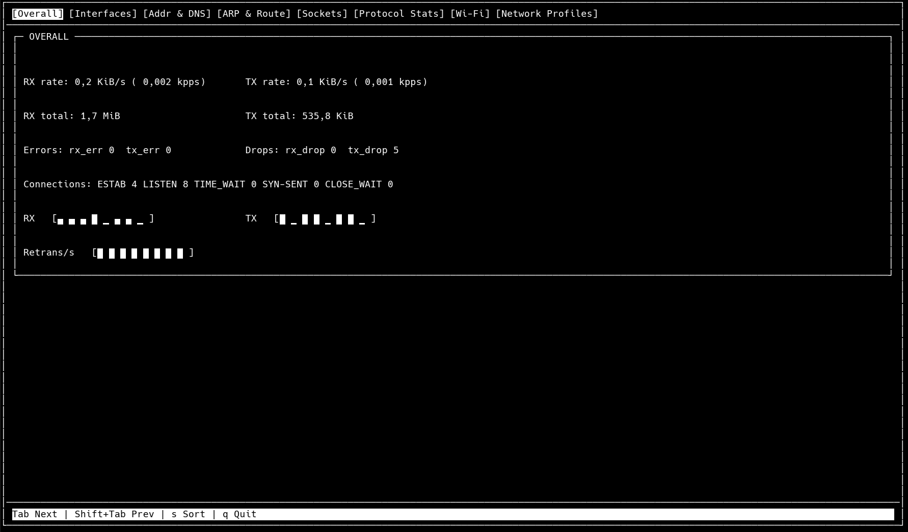
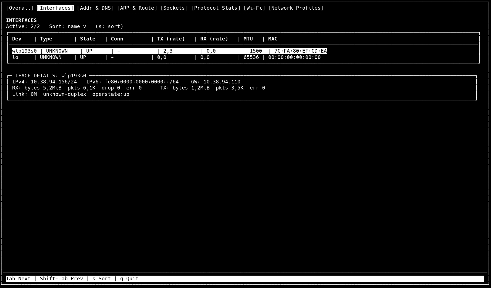
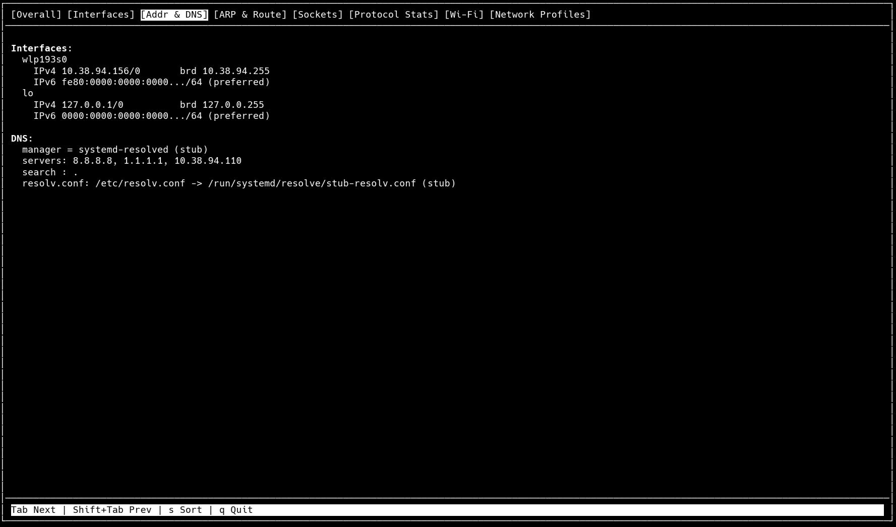
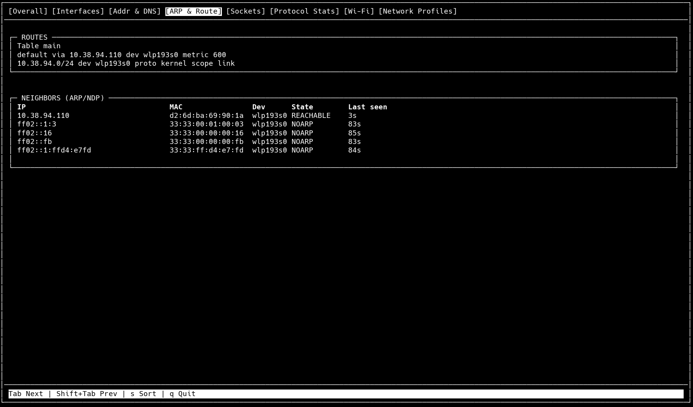
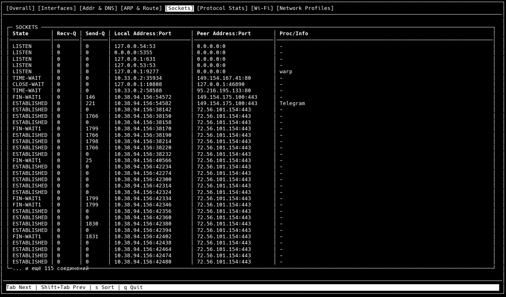
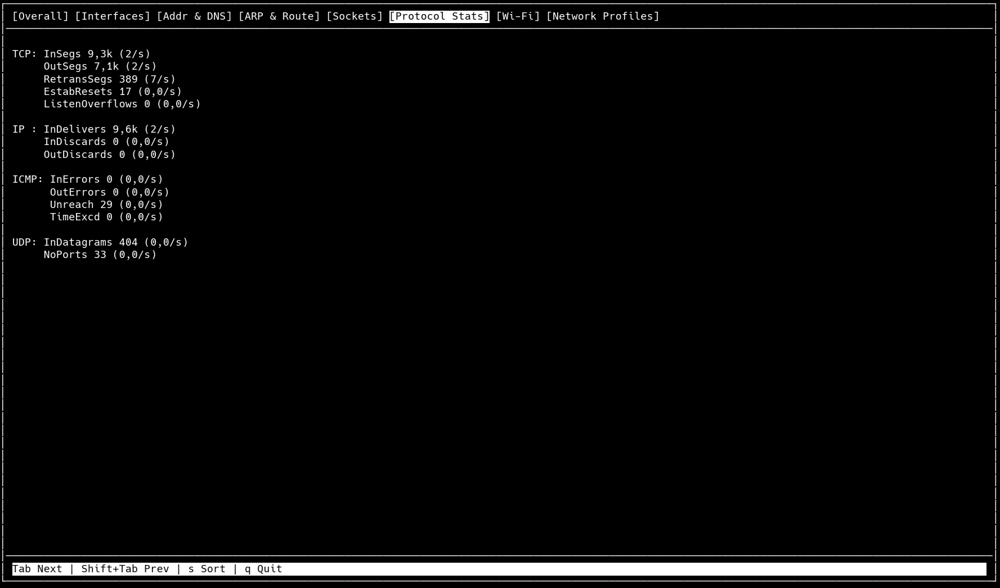

# Net-Stats-TUI

`Net-Stats-TUI` — это терминальная утилита для просмотра текущего состояния сетевого стека Linux. Проект написан на C, отрисовывается через `ncurses` и организован по схеме: потоки из `reactor` собирают данные из системы, модули `data` хранят синхронизированные снимки состояния, а модули `draw` рисуют каждый раздел в TUI. Приложение собирается через CMake и состоит из восьми отдельных разделов, чтобы можно было последовательно перейти от общего обзора системы к интерфейсам, адресации, маршрутизации, сокетам, протокольной статистике, Wi‑Fi и сохраненным профилям NetworkManager.

Во время работы программа запускает по одному фоновому потоку обновления на каждый раздел. Эти потоки читают данные из таких источников, как `/proc`, `/sys`, keyfile-профили NetworkManager, а для Wi‑Fi при наличии зависимостей также используют `libnl`/`nl80211`. Главный UI-поток затем читает снимки состояния и отрисовывает их в интерфейсе.

## Структура проекта

- `src/reactor/` — фоновые сборщики данных для каждого раздела
- `src/data/` — синхронизированное хранение структур
- `src/draw/` — логика отрисовки вкладок через `ncurses`
- `src/main.c` — переключение вкладок, главный цикл
- `CMakeLists.txt` — конфигурация сборки и подключение опциональных зависимостей
- `install.sh` — установочный скрипт для Linux
- `uninstall.sh` — скрипт удаления установленной утилиты

## Разделы

### 1. Overall
Раздел `Overall` — это верхнеуровневый обзор сетевого состояния всей системы. Здесь показываются текущие RX/TX скорости, суммарный RX/TX трафик, активность в пакетах в секунду, sparklines для ретрансмитов, счетчики состояний соединений, а также агрегированные ошибки и дропы. Это самый быстрый способ понять текущее сетевое состояние системы.



### 2. Interfaces
Раздел `Interfaces` предназначен для просмотра интерфейсов по отдельности. Он содержит сортируемую таблицу устройств и панель деталей для выбранного интерфейса. В разделе отображаются имя устройства, тип, состояние, имя подключения, TX/RX скорость, MTU, MAC, IPv4/IPv6 данные, gateway-подсказки, суммарные байты и пакеты, дропы, ошибки, скорость линка, duplex и operstate. Это основной экран для сравнения сетевых интерфейсов между собой.



### 3. Addr & DNS
Раздел `Addr & DNS` объединяет адресацию интерфейсов и информацию о том, кто управляет DNS. Он показывает IPv4 и IPv6 адреса по интерфейсам, а ниже — summary по DNS manager, resolver path, списку DNS-серверов и search domains. Внутри раздел объединяет данные адресов интерфейсов, парсинг resolver-конфигурации и анализ симлинка `/etc/resolv.conf`.



### 4. ARP & Route
Раздел `ARP & Route` разделен на маршруты и neighbor-записи. Блок routes показывает основную IPv4 routing table в читаемом виде: default routes, префиксы назначения, gateway, интерфейсы и метрики. Блок neighbors отображает записи в стиле ARP/NDP с IP, MAC, интерфейсом, состоянием и временем последнего наблюдения, если оно доступно.



### 5. Sockets
Раздел `Sockets` — это таблица сокетов в формате `ss`. Он показывает состояние, receive queue, send queue, local address/port, peer address/port и process information. Реактор этого раздела читает `/proc/net/tcp`, `/proc/net/tcp6`, `/proc/net/udp` и `/proc/net/udp6`, а затем сопоставляет socket inode с данными процессов через `/proc/<pid>/fd` и `/proc/<pid>/comm`.



### 6. Protocol Stats
Раздел `Protocol Stats` показывает накопительные счетчики протоколов и их изменения в секунду для TCP, IP, ICMP, UDP и части IPv6-показателей. Источники данных — `/proc/net/snmp`, `/proc/net/netstat` и `/proc/net/snmp6`.



### 7. Wi‑Fi
Раздел `Wi‑Fi` посвящен только беспроводным интерфейсам. Он объединяет метрики из `/proc/net/wireless` и, при наличии нужных библиотек, запросы через `libnl`/`nl80211`. Раздел может отображать имя интерфейса, состояние association, SSID, BSSID, RSSI, quality, bitrate, MCS, retry rate и beacon loss rate. Если `libnl` недоступна, проект использует fallback через файловые источники и все равно показывает урезанный, но полезный wireless-summary.

### 8. Network Profiles
Раздел `Network Profiles` ориентирован на сетевые профили. Он сканирует keyfile-профили NetworkManager и строит список сохраненных профилей подключения с такими полями, как имя профиля, UUID, тип, interface/device hint и autoconnect-driven state hint.

## Установка как Linux-утилиты

Если проект скачан как обычный Git-репозиторий по HTTPS, то дальше достаточно запустить установочный скрипт:

```bash
git clone https://github.com/SERS-S/Net-Stats-TUI.git
cd Net-Stats-TUI
chmod +x install.sh && ./install.sh
```

Скрипт:

- определяет дистрибутив Linux
- ставит нужные зависимости
- собирает проект в режиме `Release`
- устанавливает бинарник в `/usr/local/bin/net-stats`

После этого приложение можно запускать как обычную системную утилиту:

```bash
net-stats
```

Для удаления утилиты:

```bash
chmod +x uninstall.sh && ./uninstall.sh
```

## Ручная сборка

Если не использовать установочный скрипт, проект можно собрать вручную:

```bash
cmake -S . -B build_vscode -DCMAKE_BUILD_TYPE=Debug
cmake --build build_vscode --target net-stats -- -j
./build_vscode/net-stats
```
